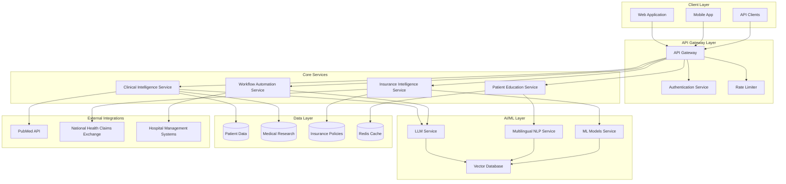
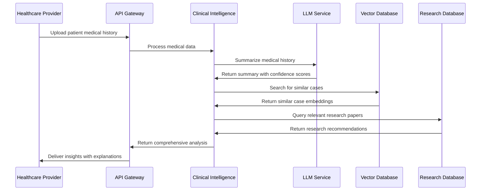
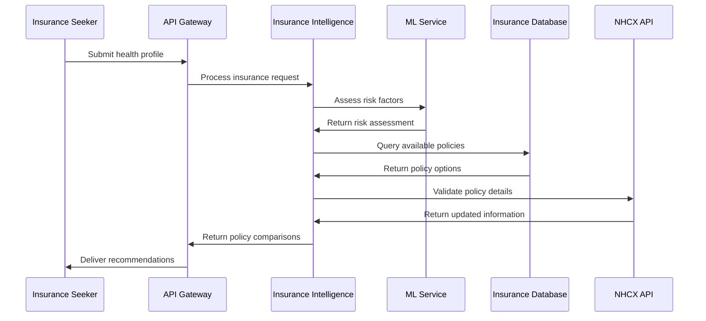

# Design Document: SahayAI Healthcare Platform

## System Overview

SahayAI is a comprehensive healthcare AI platform designed for the Indian healthcare ecosystem, serving four distinct user groups through specialized AI-powered modules:

1. **Clinical Intelligence**: Medical history summarization and research recommendations for healthcare providers
2. **Workflow Automation**: Natural language to deployable AI agents for hospital operations
3. **Patient Education**: Interactive, multilingual health education and care navigation
4. **Insurance Intelligence**: Plan comparison, claim analysis, and guidance system

The platform leverages Large Language Models (LLMs), multilingual NLP, and machine learning to provide explainable healthcare assistance across Hindi, English, Tamil, Telugu, and Bengali languages, targeting Tier-2 and Tier-3 populations with emphasis on accessibility and transparency.

## High-Level Architecture

### System Architecture Diagram



### Architectural Principles

- **Microservices Architecture**: Domain-driven service decomposition for scalability and maintainability
- **API-First Design**: RESTful APIs with OpenAPI specifications for all service interactions
- **Event-Driven Communication**: Asynchronous messaging for non-critical operations
- **Cloud-Native**: Containerized services with Kubernetes orchestration
- **Security by Design**: Zero-trust architecture with end-to-end encryption

## Component Responsibilities

### Core Services

**API Gateway Service**
- Request routing and load balancing across microservices
- Authentication and authorization enforcement
- Rate limiting and API versioning
- Request/response logging and monitoring

**Clinical Intelligence Service**
- Medical history analysis and summarization
- Research paper recommendation engine
- Clinical decision support with explainable AI
- Integration with medical research databases

**Workflow Automation Service**
- Natural language processing for workflow descriptions
- AI agent generation and configuration
- Deployment orchestration and monitoring
- Integration with hospital management systems

**Patient Education Service**
- Multilingual content management and delivery
- Interactive quiz generation and assessment
- Medical terminology translation and explanation
- Personalized learning path recommendations

**Insurance Intelligence Service**
- Health insurance plan comparison and analysis
- Claims processing guidance and likelihood assessment
- Risk evaluation for pre-existing conditions
- Integration with NHCX and insurance provider APIs

### Supporting Services

**AI/ML Orchestration Service**
- Centralized model management and versioning
- Inference request routing and load balancing
- Model performance monitoring and A/B testing
- GPU resource allocation and optimization

**Multilingual NLP Service**
- Language detection and translation
- Medical terminology normalization across languages
- Semantic similarity and embedding generation
- Cultural context adaptation for Indian languages

**Data Management Service**
- Encrypted data storage and retrieval
- Data anonymization and privacy protection
- Audit logging and compliance reporting
- Backup and disaster recovery operations

## AI & Model Design

## AI & Model Design

### Model Architecture

**Large Language Models (LLMs)**
- **Primary Model**: Fine-tuned GPT-4 or Claude for medical text understanding
- **Specialized Models**: Domain-specific models for clinical summarization and research matching
- **Multilingual Models**: IndicBERT and mBERT for Indian language processing
- **Model Serving**: vLLM or TensorRT-LLM for optimized inference

**Vector Embeddings**
- **Medical Embeddings**: BioBERT and ClinicalBERT for medical concept representation
- **Multilingual Embeddings**: Sentence-BERT models for cross-language semantic similarity
- **Vector Database**: Pinecone or Weaviate for similarity search and retrieval

**Specialized AI Components**
- **Named Entity Recognition**: Custom NER models for medical entities in Indian languages
- **Classification Models**: Insurance risk assessment and claim likelihood prediction
- **Recommendation Systems**: Collaborative filtering for research paper recommendations

### Model Training and Fine-tuning

**Data Sources**
- Anonymized medical records (with proper consent and ethics approval)
- Public medical research databases (PubMed, Indian medical journals)
- Insurance policy documents and claim histories
- Multilingual medical terminology dictionaries

**Training Strategy**
- **Transfer Learning**: Start with pre-trained models and fine-tune on healthcare data
- **Multi-task Learning**: Joint training across summarization, classification, and generation tasks
- **Continual Learning**: Regular model updates with new data while preventing catastrophic forgetting

## Data Flow & Workflows

### Clinical Intelligence Workflow



### Insurance Intelligence Workflow



### Data Processing Pipeline

**Real-time Processing**
- Patient data ingestion and validation
- Immediate AI inference for critical operations
- Real-time translation and content adaptation
- Live policy comparison and risk assessment

**Batch Processing**
- Medical research database synchronization
- Insurance policy updates and indexing
- Model training data preparation
- Analytics and reporting generation

## Security, Privacy & Guardrails

## Correctness Properties

*A property is a characteristic or behavior that should hold true across all valid executions of a system—essentially, a formal statement about what the system should do. Properties serve as the bridge between human-readable specifications and machine-verifiable correctness guarantees.*

Let me analyze the acceptance criteria to determine which ones are testable as properties, examples, or edge cases.

Based on the prework analysis, I'll now convert the testable acceptance criteria into correctness properties:

**Property 1: Clinical Intelligence Performance and Functionality**
*For any* patient medical history and diagnostic data, the Clinical Intelligence Module should generate comprehensive summaries and relevant research recommendations within specified time limits (30-45 seconds) while providing explainable insights with confidence scores
**Validates: Requirements 1.1, 1.2, 1.3, 1.4**

**Property 2: Workflow Automation Generation**
*For any* natural language workflow description, the Workflow Automation Module should parse requirements, generate deployable AI agents within 5 minutes, and provide customization options
**Validates: Requirements 2.1, 2.2, 2.3**

**Property 3: Multilingual Patient Education**
*For any* patient condition and supported language (Hindi, English, Tamil, Telugu, Bengali), the Patient Education Module should provide relevant interactive quizzes and multilingual explanations with visual aids for medical terms
**Validates: Requirements 3.1, 3.2, 3.3**

**Property 4: Comprehensive Insurance Intelligence**
*For any* health profile with or without pre-existing conditions, the Insurance Intelligence Module should compare plans across providers, evaluate suitability, highlight limitations, and provide early rejection warnings when applicable
**Validates: Requirements 4.1, 4.2, 4.3**

**Property 5: Claims Analysis and Guidance**
*For any* claim details and policy combination, the Insurance Intelligence Module should compare against policy clauses, explain acceptance/rejection likelihood with reasoning, and provide corrective guidance for likely rejections
**Validates: Requirements 5.1, 5.2, 5.3**

**Property 6: Comprehensive Security and Access Control**
*For any* data operation, the SahayAI Platform should encrypt data in transit and at rest, maintain detailed audit logs with timestamps, and enforce role-based access control for all user types
**Validates: Requirements 6.1, 6.2, 6.3**

**Property 7: AI Processing Performance**
*For any* AI processing request, the SahayAI Platform should complete operations within 30 seconds
**Validates: Requirements 7.3**

**Property 8: Integration and Interoperability**
*For any* external system integration, the SahayAI Platform should provide functional REST APIs, support standard healthcare data formats (HL7, FHIR), and handle real-time data updates
**Validates: Requirements 8.1, 8.2, 8.3**

## Error Handling

### Error Classification and Response Strategy

**Clinical Intelligence Errors:**
- **Data Quality Issues**: Invalid or incomplete patient records trigger validation errors with specific field-level feedback
- **Processing Timeouts**: If summarization exceeds 30 seconds, return partial results with timeout notification
- **Research API Failures**: Graceful degradation with cached recommendations when external research databases are unavailable

**Workflow Automation Errors:**
- **Parsing Failures**: Natural language descriptions that cannot be parsed return structured error messages with suggestions for clarification
- **Generation Timeouts**: If agent generation exceeds 5 minutes, provide status updates and allow extended processing
- **Deployment Failures**: Rollback mechanisms for failed agent deployments with detailed error reporting

**Patient Education Errors:**
- **Translation Failures**: Fallback to English content with notification when target language translation fails
- **Content Not Found**: Default educational content for unknown conditions with suggestion to contact healthcare provider
- **Quiz Generation Errors**: Simplified quiz format when complex quiz generation fails

**Insurance Intelligence Errors:**
- **Data Synchronization Issues**: Stale data warnings when insurance policy information is outdated
- **Analysis Failures**: Conservative risk assessments when automated analysis cannot determine outcomes
- **External API Failures**: Cached policy information with freshness indicators when real-time data is unavailable

### Error Response Format

```typescript
interface ErrorResponse {
  errorCode: string
  message: string
  details: ErrorDetails
  suggestedActions: string[]
  timestamp: Date
  correlationId: string
}

interface ErrorDetails {
  module: string
  operation: string
  inputValidation?: ValidationError[]
  systemStatus?: SystemStatus
}
```

## Testing Strategy

### Dual Testing Approach

The SahayAI platform requires both unit testing and property-based testing to ensure comprehensive coverage:

**Unit Testing Focus:**
- Specific examples of medical history summarization with known inputs and expected outputs
- Edge cases such as empty patient records, malformed data, and boundary conditions
- Integration points between modules and external services
- Error conditions and exception handling scenarios
- Authentication and authorization workflows

**Property-Based Testing Focus:**
- Universal properties that hold across all valid inputs using randomized test data
- Performance characteristics under varying load conditions
- Data consistency and integrity across all operations
- Security properties across all user interactions and data operations

### Property-Based Testing Configuration

**Testing Framework**: Use Hypothesis (Python) or fast-check (TypeScript/JavaScript) for property-based testing
**Test Configuration**: Minimum 100 iterations per property test to ensure comprehensive input coverage
**Test Tagging**: Each property test must reference its corresponding design document property

**Example Test Tags:**
- **Feature: care-ai-healthcare-platform, Property 1: Clinical Intelligence Performance and Functionality**
- **Feature: care-ai-healthcare-platform, Property 2: Workflow Automation Generation**
- **Feature: care-ai-healthcare-platform, Property 3: Multilingual Patient Education**

### Test Data Generation Strategy

**Synthetic Medical Data**: Generate realistic but anonymized patient records, medical histories, and diagnostic data
**Multilingual Content**: Test content generation and translation across all supported languages
**Insurance Scenarios**: Create diverse health profiles and policy combinations for comprehensive testing
**Workflow Variations**: Generate various natural language workflow descriptions for automation testing

### Integration Testing

**External Service Mocking**: Mock external APIs (PubMed, NHCX, HMS) for consistent testing environments
**End-to-End Scenarios**: Test complete user journeys across all four modules
**Performance Testing**: Validate response time requirements under simulated load conditions
**Security Testing**: Verify encryption, access control, and audit logging across all operations

The testing strategy ensures that both specific examples work correctly (unit tests) and that universal properties hold across all possible inputs (property tests), providing comprehensive validation of the SahayAI platform's correctness and reliability.
### Data Protection Framework

**Encryption Standards**
- **Data at Rest**: AES-256 encryption for all stored patient data
- **Data in Transit**: TLS 1.3 for all API communications
- **Key Management**: Hardware Security Modules (HSM) for encryption key storage
- **Database Encryption**: Transparent Data Encryption (TDE) for database files

**Privacy Controls**
- **Data Minimization**: Collect only necessary data for specific use cases
- **Anonymization**: Remove or pseudonymize PII in analytics and training data
- **Consent Management**: Granular consent tracking for data usage purposes
- **Right to Erasure**: Automated data deletion upon user request

**Access Control**
- **Role-Based Access Control (RBAC)**: Granular permissions based on user roles
- **Multi-Factor Authentication (MFA)**: Required for all healthcare provider accounts
- **Zero Trust Architecture**: Verify every request regardless of source
- **Session Management**: Automatic session timeout and secure token handling

### AI Safety Guardrails

**Model Bias Prevention**
- **Demographic Fairness**: Regular auditing for bias across age, gender, and regional groups
- **Language Equity**: Ensure equal performance across all supported Indian languages
- **Medical Accuracy**: Continuous validation against medical literature and expert review
- **Transparency Requirements**: All AI recommendations must include confidence scores and reasoning

**Content Safety**
- **Medical Disclaimer**: Clear disclaimers that AI provides assistance, not medical advice
- **Harmful Content Detection**: Filters to prevent generation of dangerous medical advice
- **Professional Oversight**: Healthcare provider review required for critical recommendations
- **Escalation Protocols**: Automatic escalation for high-risk scenarios

## Scalability & Reliability Considerations

### Horizontal Scaling Strategy

**Microservices Scaling**
- **Auto-scaling**: Kubernetes Horizontal Pod Autoscaler based on CPU/memory metrics
- **Load Balancing**: Application Load Balancers with health checks and circuit breakers
- **Database Sharding**: Partition patient data by region or hospital for improved performance
- **Caching Strategy**: Multi-tier caching with Redis for frequently accessed data

**AI Model Scaling**
- **Model Serving**: Multiple model replicas with GPU resource pooling
- **Inference Optimization**: Model quantization and batching for improved throughput
- **Edge Deployment**: Regional model deployment for reduced latency
- **A/B Testing**: Gradual rollout of model updates with performance monitoring

### Reliability and Fault Tolerance

**High Availability Design**
- **Multi-Region Deployment**: Active-passive setup across multiple AWS/Azure regions
- **Database Replication**: Master-slave replication with automatic failover
- **Service Mesh**: Istio for service-to-service communication and fault injection
- **Disaster Recovery**: Regular backups and tested recovery procedures

**Monitoring and Observability**
- **Application Monitoring**: Prometheus and Grafana for metrics and alerting
- **Distributed Tracing**: Jaeger for request tracing across microservices
- **Log Aggregation**: ELK stack for centralized logging and analysis
- **Health Checks**: Comprehensive health endpoints for all services

## Trade-offs & Limitations

### Technical Trade-offs

**Performance vs. Accuracy**
- **Model Size**: Larger models provide better accuracy but slower inference times
- **Caching**: Aggressive caching improves performance but may serve stale data
- **Real-time vs. Batch**: Real-time processing for critical operations, batch for analytics

**Cost vs. Capability**
- **GPU Resources**: High-performance models require expensive GPU infrastructure
- **Storage Costs**: Encrypted storage and backups increase operational costs
- **Third-party APIs**: External service dependencies add cost and complexity

### Current Limitations

**Language Support**
- Initial support limited to 5 Indian languages (Hindi, English, Tamil, Telugu, Bengali)
- Medical terminology translation accuracy varies by language
- Cultural context adaptation requires ongoing refinement

**AI Model Constraints**
- Models trained on available data may not cover all medical specialties
- Explainability limited by current AI interpretability techniques
- Continuous learning requires careful validation to prevent model drift

**Integration Challenges**
- Hospital system integration depends on existing infrastructure capabilities
- Insurance API availability varies by provider
- Real-time data synchronization complexity with external systems

## Deployment & Operational Overview

### Infrastructure Architecture

**Cloud Platform**: Multi-cloud deployment (AWS primary, Azure secondary)
**Container Orchestration**: Kubernetes with Helm charts for deployment
**Service Mesh**: Istio for traffic management and security
**CI/CD Pipeline**: GitLab CI with automated testing and deployment

### Deployment Strategy

**Environment Progression**
1. **Development**: Local development with Docker Compose
2. **Staging**: Kubernetes cluster with production-like data
3. **Production**: Multi-region deployment with blue-green deployments

**Release Management**
- **Feature Flags**: Gradual feature rollout with LaunchDarkly
- **Canary Deployments**: Gradual traffic shifting for new releases
- **Rollback Procedures**: Automated rollback triggers based on error rates

### Operational Procedures

**Monitoring and Alerting**
- **SLA Monitoring**: 99.9% uptime target with automated alerting
- **Performance Metrics**: Response time, throughput, and error rate tracking
- **Business Metrics**: User engagement, AI accuracy, and system utilization

**Maintenance and Updates**
- **Model Updates**: Monthly model retraining with validation pipelines
- **Security Patches**: Automated security updates with testing
- **Data Backup**: Daily encrypted backups with quarterly disaster recovery tests

## Future Enhancements

### Short-term Roadmap (3-6 months)

**Enhanced AI Capabilities**
- **Voice Interface**: Speech-to-text and text-to-speech in Indian languages
- **Image Analysis**: Medical image analysis for radiology and pathology
- **Predictive Analytics**: Early warning systems for health deterioration

**Platform Improvements**
- **Mobile Applications**: Native iOS and Android apps with offline capabilities
- **Integration Expansion**: Additional hospital management system connectors
- **Performance Optimization**: Sub-15-second response times for AI operations

### Long-term Vision (6-18 months)

**Advanced Features**
- **Personalized Medicine**: AI-driven treatment personalization based on genetic data
- **Population Health**: Community health analytics and intervention recommendations
- **Research Platform**: Collaborative research tools for medical professionals

**Ecosystem Expansion**
- **Telemedicine Integration**: Video consultation platform with AI assistance
- **Pharmacy Integration**: Medication management and drug interaction checking
- **Wearable Device Support**: Integration with fitness trackers and health monitors

**Regulatory and Compliance**
- **Medical Device Certification**: Pursue regulatory approval for clinical decision support
- **International Expansion**: Adapt platform for other emerging markets
- **Research Partnerships**: Collaborate with medical institutions for clinical validation