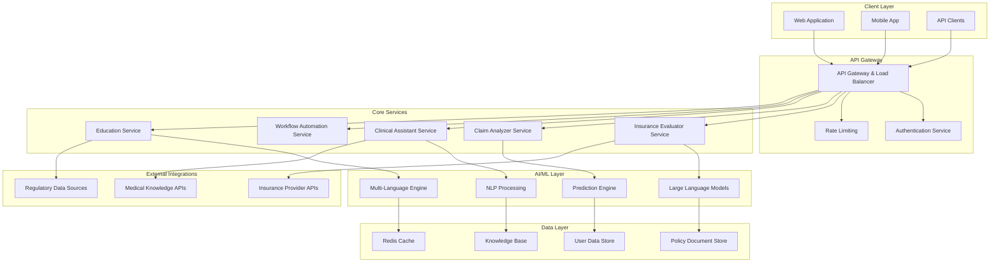
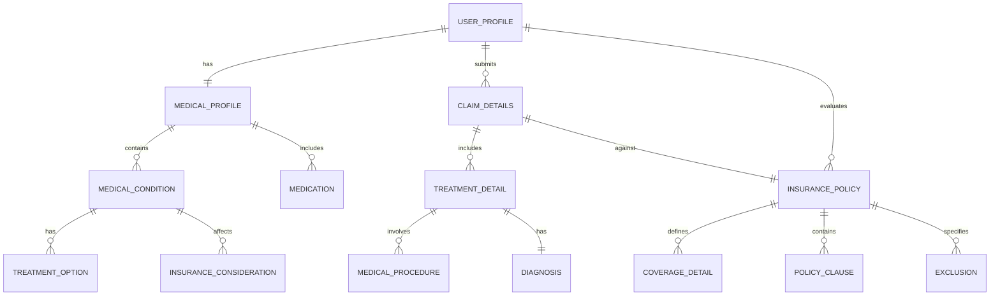

# Design Document: Healthcare Insurance Intelligence Platform

## Overview

The Healthcare Insurance Intelligence Platform is a comprehensive AI-powered system that democratizes access to healthcare insurance information and decision-making tools. The platform addresses critical gaps in insurance transparency by providing unbiased analysis, multi-language support, and predictive capabilities for both pre-purchase evaluation and post-purchase claim analysis.

The system leverages modern AI technologies including Large Language Models (LLMs), Natural Language Processing (NLP), and machine learning to process complex insurance documents, predict outcomes, and provide actionable insights to users across different demographics and technical literacy levels.

## Architecture

The platform follows a microservices architecture with clear separation of concerns, enabling scalability and maintainability. The system is designed around five core domains:

### High-Level Architecture



### Service Architecture Principles

1. **Domain-Driven Design**: Each service represents a distinct business domain
2. **Event-Driven Communication**: Services communicate through events for loose coupling
3. **CQRS Pattern**: Separate read and write operations for optimal performance
4. **Circuit Breaker Pattern**: Resilience against external service failures
5. **Saga Pattern**: Distributed transaction management across services

## Components and Interfaces

### 1. Insurance Evaluator Service

**Purpose**: Compares insurance plans and predicts application success rates

**Key Components**:
- `PolicyComparator`: Analyzes and compares insurance policies
- `RiskAssessment`: Calculates rejection probability based on medical profile
- `CoverageAnalyzer`: Evaluates coverage for specific medical conditions
- `RecommendationEngine`: Generates personalized insurance recommendations

**Interfaces**:
```typescript
interface InsuranceEvaluatorService {
  comparePlans(medicalProfile: MedicalProfile, preferences: UserPreferences): Promise<PlanComparison[]>
  assessRejectionRisk(medicalProfile: MedicalProfile, insurerId: string): Promise<RiskAssessment>
  analyzeCoverage(policyId: string, conditions: MedicalCondition[]): Promise<CoverageAnalysis>
  getRecommendations(userProfile: UserProfile): Promise<InsuranceRecommendation[]>
}

interface PlanComparison {
  insurerId: string
  planName: string
  premiumCost: number
  coverageScore: number
  exclusions: string[]
  rejectionRisk: number
  confidenceInterval: [number, number]
}
```

### 2. Claim Analyzer Service

**Purpose**: Predicts claim success probability and provides guidance

**Key Components**:
- `ClaimPredictor`: ML model for claim success prediction
- `PolicyClauseAnalyzer`: Matches claim details against policy terms
- `DocumentChecker`: Validates required documentation
- `AppealAdvisor`: Suggests appeal strategies for rejected claims

**Interfaces**:
```typescript
interface ClaimAnalyzerService {
  predictClaimSuccess(claimDetails: ClaimDetails, policyId: string): Promise<ClaimPrediction>
  analyzeRequiredDocuments(claimType: string, policyId: string): Promise<DocumentRequirement[]>
  suggestAppealStrategy(rejectedClaim: RejectedClaim): Promise<AppealStrategy>
  compareClauseMatch(claimDetails: ClaimDetails, policyClause: PolicyClause): Promise<ClauseMatchResult>
}

interface ClaimPrediction {
  successProbability: number
  confidenceScore: number
  supportingClauses: PolicyClause[]
  opposingClauses: PolicyClause[]
  requiredDocuments: string[]
  estimatedProcessingTime: number
}
```

### 3. Multi-Language Engine

**Purpose**: Provides comprehensive multi-language support

**Key Components**:
- `TranslationService`: Real-time translation of content
- `LocalizationManager`: Cultural and regional adaptations
- `TerminologyManager`: Consistent insurance term translations
- `ContentSimplifier`: Simplifies complex insurance language

**Interfaces**:
```typescript
interface MultiLanguageEngine {
  translateContent(content: string, targetLanguage: Language): Promise<TranslatedContent>
  simplifyInsuranceTerms(content: string, language: Language): Promise<SimplifiedContent>
  getLocalizedContent(contentId: string, language: Language): Promise<LocalizedContent>
  validateTranslationAccuracy(original: string, translated: string): Promise<AccuracyScore>
}

interface TranslatedContent {
  translatedText: string
  confidence: number
  alternativeTranslations: string[]
  culturalNotes: string[]
}
```

### 4. Document Parser Service

**Purpose**: Processes and extracts information from insurance documents

**Key Components**:
- `OCRProcessor`: Optical Character Recognition for scanned documents
- `StructureExtractor`: Identifies document structure and sections
- `EntityExtractor`: Extracts key insurance entities (coverage, exclusions, terms)
- `ValidationEngine`: Validates document authenticity and completeness

**Interfaces**:
```typescript
interface DocumentParserService {
  parseDocument(document: DocumentInput): Promise<ParsedDocument>
  extractEntities(document: ParsedDocument): Promise<InsuranceEntity[]>
  validateDocument(document: ParsedDocument): Promise<ValidationResult>
  updateKnowledgeBase(parsedDocument: ParsedDocument): Promise<void>
}

interface ParsedDocument {
  documentId: string
  documentType: DocumentType
  extractedText: string
  structuredData: InsuranceData
  confidence: number
  processingMetadata: ProcessingMetadata
}
```

### 5. Clinical Assistant Service

**Purpose**: Provides healthcare provider support and medical insights

**Key Components**:
- `MedicalHistorySummarizer`: Generates comprehensive patient summaries
- `ResearchRecommender`: Suggests relevant medical research
- `ClinicalDecisionSupport`: Provides explainable clinical recommendations
- `RegionalInsightEngine`: Incorporates location-based disease patterns

**Interfaces**:
```typescript
interface ClinicalAssistantService {
  summarizeMedicalHistory(patientRecords: MedicalRecord[]): Promise<MedicalSummary>
  recommendResearch(clinicalQuery: ClinicalQuery): Promise<ResearchRecommendation[]>
  provideClinicalSupport(patientData: PatientData, query: string): Promise<ClinicalRecommendation>
  getRegionalInsights(location: Location, condition: MedicalCondition): Promise<RegionalInsight>
}

interface MedicalSummary {
  patientId: string
  chronicConditions: MedicalCondition[]
  medicationHistory: Medication[]
  riskFactors: RiskFactor[]
  treatmentTimeline: TreatmentEvent[]
  insuranceImplications: InsuranceImplication[]
}
```

## Data Models

### Core Domain Models

```typescript
// User and Profile Models
interface UserProfile {
  userId: string
  personalInfo: PersonalInfo
  medicalProfile: MedicalProfile
  preferences: UserPreferences
  language: Language
  location: Location
}

interface MedicalProfile {
  preExistingConditions: MedicalCondition[]
  currentMedications: Medication[]
  allergies: Allergy[]
  familyHistory: FamilyMedicalHistory
  riskFactors: RiskFactor[]
  lastUpdated: Date
}

// Insurance Models
interface InsurancePolicy {
  policyId: string
  insurerId: string
  policyName: string
  coverageDetails: CoverageDetail[]
  exclusions: Exclusion[]
  premiumStructure: PremiumStructure
  claimProcess: ClaimProcess
  documentVersion: string
  effectiveDate: Date
  lastUpdated: Date
}

interface CoverageDetail {
  conditionType: MedicalConditionType
  coveragePercentage: number
  maxCoverageAmount: number
  waitingPeriod: number
  copaymentRequired: boolean
  preAuthorizationRequired: boolean
}

// Claim Models
interface ClaimDetails {
  claimId: string
  policyId: string
  patientId: string
  treatmentDetails: TreatmentDetail[]
  medicalDocuments: MedicalDocument[]
  claimAmount: number
  claimType: ClaimType
  submissionDate: Date
  status: ClaimStatus
}

interface TreatmentDetail {
  treatmentId: string
  diagnosis: Diagnosis
  procedures: MedicalProcedure[]
  medications: Medication[]
  hospitalDetails: HospitalInfo
  treatmentDuration: number
  totalCost: number
}

// Knowledge Base Models
interface MedicalCondition {
  conditionId: string
  name: string
  icdCode: string
  severity: SeverityLevel
  chronicStatus: boolean
  treatmentOptions: TreatmentOption[]
  insuranceConsiderations: InsuranceConsideration[]
}

interface PolicyClause {
  clauseId: string
  policyId: string
  clauseType: ClauseType
  content: string
  applicableConditions: string[]
  exclusionRules: ExclusionRule[]
  interpretationNotes: string[]
}
```

### Data Relationships



## Error Handling

### Error Classification and Response Strategy

**1. User Input Errors**
- Invalid medical condition codes
- Incomplete profile information
- Unsupported document formats
- **Response**: Immediate validation feedback with correction suggestions

**2. External Service Failures**
- Insurance provider API timeouts
- Medical database unavailability
- Translation service errors
- **Response**: Circuit breaker pattern with graceful degradation

**3. AI/ML Model Errors**
- Low confidence predictions
- Model drift detection
- Inconsistent results across models
- **Response**: Confidence thresholds with human review triggers

**4. Data Quality Issues**
- Corrupted policy documents
- Inconsistent medical terminology
- Missing critical information
- **Response**: Data validation pipelines with quality scoring

### Error Recovery Mechanisms

```typescript
interface ErrorHandler {
  handleUserInputError(error: UserInputError): Promise<ErrorResponse>
  handleExternalServiceError(error: ExternalServiceError): Promise<FallbackResponse>
  handleAIModelError(error: AIModelError): Promise<ModelFallbackResponse>
  handleDataQualityError(error: DataQualityError): Promise<DataCorrectionResponse>
}

interface ErrorResponse {
  errorCode: string
  userMessage: string
  suggestedActions: string[]
  retryable: boolean
  fallbackOptions: FallbackOption[]
}
```

## Testing Strategy

### Dual Testing Approach

The platform requires both unit testing and property-based testing to ensure comprehensive coverage:

**Unit Testing Focus**:
- Specific examples of insurance calculations
- Edge cases in document parsing
- Error condition handling
- Integration points between services
- User interface interactions

**Property-Based Testing Focus**:
- Universal properties that hold across all inputs
- Insurance calculation consistency
- Document parsing accuracy
- Multi-language translation consistency
- Claim prediction reliability

### Property-Based Testing Configuration

- **Testing Library**: Use Hypothesis (Python) or fast-check (TypeScript/JavaScript)
- **Minimum Iterations**: 100 iterations per property test
- **Test Tagging**: Each property test must reference its design document property
- **Tag Format**: **Feature: healthcare-insurance-ai, Property {number}: {property_text}**

### Testing Infrastructure

```typescript
interface TestingFramework {
  runPropertyTests(properties: PropertyTest[]): Promise<TestResult[]>
  generateTestData(schema: DataSchema): Promise<TestData[]>
  validateModelConsistency(model: AIModel, testCases: TestCase[]): Promise<ConsistencyReport>
  performRegressionTesting(baseline: ModelVersion, current: ModelVersion): Promise<RegressionReport>
}
```

The testing strategy ensures that critical insurance evaluation logic and claim prediction algorithms maintain accuracy and reliability across diverse inputs and scenarios.

## Correctness Properties

*A property is a characteristic or behavior that should hold true across all valid executions of a system—essentially, a formal statement about what the system should do. Properties serve as the bridge between human-readable specifications and machine-verifiable correctness guarantees.*

### Property 1: Insurance Coverage Analysis Completeness
*For any* valid medical profile and insurance plan combination, the coverage analysis should include coverage percentages for all Pre-Existing Diseases, relevant policy clauses, and standardized comparison data
**Validates: Requirements 1.1, 1.2, 1.3, 1.5**

### Property 2: Rejection Risk Prediction Consistency
*For any* medical profile, the rejection probability calculation should return valid probability values (0-1) with confidence intervals for each insurance company
**Validates: Requirements 2.1, 2.2**

### Property 3: Alternative Recommendation Logic
*For any* risk assessment or claim analysis with low success probability, the system should provide alternative options with demonstrably better probability scores
**Validates: Requirements 2.3, 4.5**

### Property 4: Multi-Language Translation Consistency
*For any* content and supported language pair, translation should be accurate, complete, and terminologically consistent across all contexts
**Validates: Requirements 3.2, 3.4**

### Property 5: Session Data Preservation
*For any* user session, changing language or other preferences should preserve all user data, medical profiles, and analysis results
**Validates: Requirements 3.5**

### Property 6: Claim Analysis Completeness
*For any* claim details and policy combination, the analysis should identify all relevant supporting and opposing clauses with acceptance probability and detailed explanation
**Validates: Requirements 4.1, 4.2, 4.4**

### Property 7: Document Requirement Detection
*For any* incomplete claim submission, the system should generate a complete checklist of all missing required documents
**Validates: Requirements 4.3**

### Property 8: Educational Content Consistency
*For any* educational content access, the system should provide visual explanations, simplified language, and rights information in a consistent format
**Validates: Requirements 5.2, 5.4**

### Property 9: Clinical Summary Completeness
*For any* patient record upload, the generated medical history summary should include all chronic conditions, medications, risk factors, and insurance implications
**Validates: Requirements 6.1**

### Property 10: Research Recommendation Relevance
*For any* clinical query, the recommended research papers should be relevant to the query topic and include explainable reasoning for the recommendations
**Validates: Requirements 6.2, 6.3**

### Property 11: Location-Aware Insights
*For any* available location data and medical condition, the system should incorporate regional disease pattern insights into recommendations
**Validates: Requirements 6.4**

### Property 12: Workflow Generation Completeness
*For any* manual process description, the generated automation recommendations should include architecture diagrams, integration points, timelines, and resource requirements
**Validates: Requirements 7.1, 7.2, 7.4, 7.5**

### Property 13: Document Processing Round-Trip
*For any* valid policy document, parsing then reconstructing the structured knowledge representation should preserve all key terms, conditions, and coverage details
**Validates: Requirements 8.1, 8.3**

### Property 14: Document Validation Accuracy
*For any* policy document, the validation process should correctly identify authenticity issues and flag inconsistencies without false positives
**Validates: Requirements 8.2**

### Property 15: Automatic Update Propagation
*For any* document analysis completion, all affected user recommendations should be updated automatically and consistently
**Validates: Requirements 8.5**

### Property 16: Access Control Enforcement
*For any* user role and system resource, access should be granted only according to the defined role-based permissions
**Validates: Requirements 9.3**

### Property 17: Audit Trail Completeness
*For any* data operation (access, modification, deletion), a complete audit log entry should be created with timestamp, user, and operation details
**Validates: Requirements 9.4**

### Property 18: Data Portability Operations
*For any* user data export or deletion request, the operation should complete successfully and affect all user-related data across the system
**Validates: Requirements 9.5**

### Property 19: Performance Response Time Bounds
*For any* analysis request under normal load conditions, initial results should be provided within the specified 30-second time limit
**Validates: Requirements 10.1**

### Property 20: Concurrent Load Handling
*For any* system load up to 1000 concurrent users, performance should remain within acceptable bounds without degradation
**Validates: Requirements 10.2**

### Property 21: Progress Reporting Accuracy
*For any* large document processing operation, progress indicators should accurately reflect completion percentage and provide realistic time estimates
**Validates: Requirements 10.5**

### Property 22: Multi-Provider Capacity
*For any* insurance comparison request, the system should successfully analyze and compare at least 10 insurance providers simultaneously
**Validates: Requirements 1.4**

### Property 23: Historical Data Persistence
*For any* approval/rejection pattern data, the system should maintain accurate historical records and make them available for risk assessment calculations
**Validates: Requirements 2.4**

### Property 24: Language Support Capacity
*For any* supported language selection, the system should provide complete translation coverage for all interface elements and content
**Validates: Requirements 3.1**

### Property 25: Simplified Explanation Provision
*For any* technical insurance term display, the system should provide accompanying simplified explanations in the user's selected language
**Validates: Requirements 3.3**

### Property 26: Regulatory Information Currency
*For any* educational content access, the displayed regulatory information should reflect the most current available data and user rights
**Validates: Requirements 5.5**

### Property 27: Automation Opportunity Identification
*For any* hospital workflow analysis, the system should identify automation opportunities specifically in appointments, insurance verification, and billing processes
**Validates: Requirements 7.3**

### Property 28: Document Version Control
*For any* policy document update, the system should maintain complete version history and track all changes over time
**Validates: Requirements 8.4**